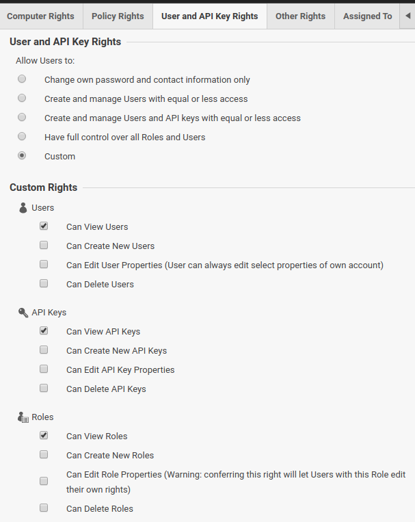

# Development

This integration at the moment mainly focuses on the
[Deep Security](https://www.trendmicro.com/en_us/business/products/hybrid-cloud/deep-security.html)
suite of features from Trend Micro for collecting data vulnerabilities in
workloads.

This integration uses the
[Deep Security API](https://automation.deepsecurity.trendmicro.com/article/dsaas/api-reference?platform=dsaas)
for collecting data.

## Prerequisites

Aside from what is documented in the [README](../README.md), no special tooling
is required to run and test this integration.

## Provider account setup

### Deep Security

To setup a Trend Micro Deep Security account for development, please take the
following steps:

1. Visit the
   [Deep Security](https://www.trendmicro.com/en_us/business/products/hybrid-cloud/deep-security.html)
   site.
1. Click `Try it for free` (shown in the image below).
1. Fill out the Trial sign up form then click `Sign up`.
1. After you have successfuly signed up, you should receive an email to confirm
   your 30 day trial. Click on the link and you should be able to sign into the
   Deep Security dashboard.

## Authentication

Once you've created your account, you'll need to generate an API Key to access
the Deep Security API.

1. First, visit https://help.deepsecurity.trendmicro.com/api-key.html and follow
   the instructions to create an API Key.
1. Upon selecting the `Role`, select `New...` to start configuring a new role
   for read only access. A new role needs to be provisioned because the scope of
   the preconfigured `Auditor` role does not provide access to User, Role, and
   API Key resources.
1. By default, everything will be setup for read only access except the content
   under `User and API Key Rights`. Click on that tab and select the `Custom`
   option under the `Allow Users to` section at the top.
1. Under the `Custom Rights` section, ensure that only the `Can View`
   permissions are enabled. Your configuration should look like this:

   

1. Click `OK` at the bottom of the role configuration window to create the role.
1. Click `Next` at bottom of the API Key form to get your API Key.
1. Copy the API Key, create a `.env` file at the root of this project, and set
   an `API_KEY` variable with the copied value.

```bash
API_KEY="paste the api key here"
```

After following the above steps, you should now be able to start contributing to
this integration.

All requests to the Deep Security API require a `api-secret-key` header to be
set with an API key when making requests
([reference authentication doc](https://automation.deepsecurity.trendmicro.com/article/dsaas/api-reference?platform=dsaas)).

After following the above steps, you should be able to now invoke the
integration to start collecting data. The integration will pull in the `API_KEY`
variable from the `.env` file and add the `api-secret-key` header with the
`API_KEY` value when making requests.
